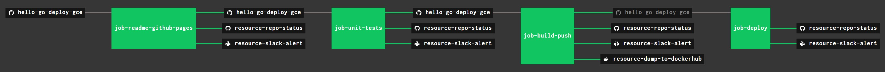

# hello-go-deploy-gce

[](https://goreportcard.com/report/github.com/JeffDeCola/hello-go-deploy-gce)
[](https://godoc.org/github.com/JeffDeCola/hello-go-deploy-gce)
[](https://codeclimate.com/github/JeffDeCola/hello-go-deploy-gce/maintainability)
[](https://codeclimate.com/github/JeffDeCola/hello-go-deploy-gce/issues)
[](http://jeffdecola.mit-license.org)

`hello-go-deploy-gce` _will test, build, push (to DockerHub) and deploy
a long running "hello-world" Docker Image to Google Compute Engine (gce).
Also, it will enable a service that kicks off the binary at boot._

I also have other repos showing different deployments,

* PaaS
  * [hello-go-deploy-aws-elastic-beanstalk](https://github.com/JeffDeCola/hello-go-deploy-aws-elastic-beanstalk)
  * [hello-go-deploy-azure-app-service](https://github.com/JeffDeCola/hello-go-deploy-azure-app-service)
  * [hello-go-deploy-gae](https://github.com/JeffDeCola/hello-go-deploy-gae)
  * [hello-go-deploy-marathon](https://github.com/JeffDeCola/hello-go-deploy-marathon)
* CaaS
  * [hello-go-deploy-amazon-ecs](https://github.com/JeffDeCola/hello-go-deploy-amazon-ecs)
  * [hello-go-deploy-amazon-eks](https://github.com/JeffDeCola/hello-go-deploy-amazon-eks)
  * [hello-go-deploy-aks](https://github.com/JeffDeCola/hello-go-deploy-aks)
  * [hello-go-deploy-gke](https://github.com/JeffDeCola/hello-go-deploy-gke)
* IaaS
  * [hello-go-deploy-amazon-ec2](https://github.com/JeffDeCola/hello-go-deploy-amazon-ec2)
  * [hello-go-deploy-azure-vm](https://github.com/JeffDeCola/hello-go-deploy-azure-vm)
  * [hello-go-deploy-gce](https://github.com/JeffDeCola/hello-go-deploy-gce)

The `hello-go-deploy-gce`
[Docker Image](https://hub.docker.com/r/jeffdecola/hello-go-deploy-gce)
on DockerHub.

The `hello-go-deploy-gce`
[GitHub Webpage](https://jeffdecola.github.io/hello-go-deploy-gce/).

## PREREQUISITES

For this exercise I used go.  Feel free to use a language of your choice.
Obviously, you will have to build the binaries and install your language
on the VM Instance during the packer build.  It should not be that difficult
to swap.

* [go](https://github.com/JeffDeCola/my-cheat-sheets/tree/master/software/development/languages/go-cheat-sheet)

To build a docker image you will need docker on your machine,

* [docker](https://github.com/JeffDeCola/my-cheat-sheets/tree/master/software/operations-tools/orchestration/builds-deployment-containers/docker-cheat-sheet)

To push a docker image you will need,

* [DockerHub account](https://hub.docker.com/)

To deploy to `gce` you will need,

* [google compute engine (gce)](https://github.com/JeffDeCola/my-cheat-sheets/tree/master/software/service-architectures/infrastructure-as-a-service/google-compute-engine-cheat-sheet)
* [packer](https://github.com/JeffDeCola/my-cheat-sheets/tree/master/software/operations-tools/orchestration/builds-deployment-containers/packer-cheat-sheet)

As a bonus, you can use Concourse CI to run the scripts,

* [concourse](https://github.com/JeffDeCola/my-cheat-sheets/tree/master/software/operations-tools/continuous-integration-continuous-deployment/concourse-cheat-sheet)
  (Optional)

## EXAMPLE 1

This example just prints hello word to the terminal.

To run from the command line,

```bash
go run main.go
```

Every 2 seconds `hello-go-deploy-gce` will print:

```bash
Hello everyone, count is: 1
Hello everyone, count is: 2
Hello everyone, count is: 3
etc...
```

## STEP 1 - TEST

Lets unit test the code,

```bash
go test -cover ./... | tee /test/test_coverage.txt
```

This script runs the above command
[/test/unit-tests.sh](https://github.com/JeffDeCola/hello-go-deploy-gce/tree/master/test/unit-tests.sh).

This script runs the above command in concourse
[/ci/scripts/unit-test.sh](https://github.com/JeffDeCola/hello-go-deploy-gce/tree/master/ci/scripts/unit-tests.sh).

## STEP 2 - BUILD (DOCKER IMAGE VIA DOCKERFILE)

We will be using a multi-stage build using a Dockerfile.
The end result will be a very small docker image around 13MB.

```bash
docker build -f build-push/Dockerfile -t jeffdecola/hello-go-deploy-gce .
```

Obviously, replace `jeffdecola` with your DockerHub username.

In stage 1, rather than copy a binary into a docker image (because
that can cause issue), the Dockerfile will build the binary in the
docker image.

If you open the DockerFile you can see it will get the dependencies and
build the binary in go,

```bash
FROM golang:alpine AS builder
RUN go get -d -v
RUN go build -o /go/bin/hello-go-deploy-gce main.go
```

In stage 2, the Dockerfile will copy the binary created in
stage 1 and place into a smaller docker base image based
on `alpine`, which is around 13MB.

You can check and test your docker image,

```bash
docker run --name hello-go-deploy-gce -dit jeffdecola/hello-go-deploy-gce
docker exec -i -t hello-go-deploy-gce /bin/bash
docker logs hello-go-deploy-gce
docker images jeffdecola/hello-go-deploy-gce:latest
```

There is a `build-push.sh` script to build and push to DockerHub.
There is also a script in the /ci folder to build and push
in concourse.

## STEP 3 - PUSH (TO DOCKERHUB)

Lets push your docker image to DockerHub.

If you are not logged in, you need to login to dockerhub,

```bash
docker login
```

Once logged in you can push,

```bash
docker push jeffdecola/hello-go-deploy-gce
```

Check you image at DockerHub. My image is located
[https://hub.docker.com/r/jeffdecola/hello-go-deploy-gce](https://hub.docker.com/r/jeffdecola/hello-go-deploy-gce).

This script runs the above commands
[/build-push/build-push.sh](https://github.com/JeffDeCola/hello-go-deploy-gce/tree/master/build-push/build-push.sh).

This script runs the above commands in concourse
[/ci/scripts/build-push.sh](https://github.com/JeffDeCola/hello-go-deploy-gce/tree/master/ci/scripts/build-push.sh).

## STEP 4 - DEPLOY (TO GCE)

Refer to my
[gce cheat sheet](https://github.com/JeffDeCola/my-cheat-sheets/tree/master/software/infrastructure-as-a-service/cloud-services-compute/google-cloud-platform-cheat-sheet/google-compute-engine.md)
for more detailed information and some nice illustrations.

There are three steps to deployment on `gce`,

* STEP 4.1 - Build a custom `image` using `packer` -
  Your boot disk that contains all your stuff (the `hello-go-deploy-gce` docker image).
* STEP 4.2 - Create an `instance template` - What HW resources you want for your VM instance.
* STEP 4.3 - Create an `instance group` - Will deploy and scale you VM instance(s).

The end goal is to have the following two services
running at boot on the VM,

* The dockerhub image `hello-go-deploy-gce`.
* The binary /bin/hello-go.

### STEP 4.1 CREATE A CUSTOM MACHINE IMAGE (USING PACKER)

Packer will be used to create the gce custom machine `image` from the
[packer template file](https://github.com/JeffDeCola/hello-go-deploy-gce/tree/master/deploy-gce/build-image/gce-packer-template-json).

Run this command,

```bash
packer $command \
    -var "account_file=$GCP_JEFFS_APP_SERVICE_ACCOUNT_PATH" \
    -var "project_id=$GCP_JEFFS_PROJECT_ID" \
    gce-packer-template.json
```

Inside the packer template file the following configurations and provisions
were done on the soon to be custom machine image,

To be able to clone a repo, you will need to create public/private
(`gce-github-vm` & `gce-github-vm.pub`) ssh keys and put the public
key at github. Place these keys in your `~/.ssh` folder.

Also note, this image will enable both the docker container and
a service at boot.

* add-user-jeff.sh - Add jeff as a user.
* move-welcome-file.sh - Add a welcome file in /home/jeff for fun.
* setup-github-ssh-keys.sh - Connect to github.
* upgrade-system.sh - update and upgrade.
* install-packages.sh - apt-get stuff.
* install-docker.sh - Install docker.
* install-go.sh - Install go 1.10.3.
* pull-private-repos.sh - Get this repo, place in /root/src.
* install-service.sh - Build the service.
* enable-service-boot.sh - enable at boot.
* enable-docker-container-boot.sh - Enable docker container at boot.

Check on `gce` that the image was created,

```bash
gcloud compute images list --no-standard-images
```

Refer to my
[create a custom image using packer](https://github.com/JeffDeCola/my-cheat-sheets/tree/master/software/infrastructure-as-a-service/cloud-services-compute/google-cloud-platform-cheat-sheet/google-compute-engine-create-image-packer.md)
cheat sheet for more detailed information on how to do this.

This script runs the create a custom `image` (using packer) commands.
[/deploy-gce/build-image/build-image.sh](https://github.com/JeffDeCola/hello-go-deploy-gce/tree/master/deploy-gce/build-image/build-image.sh).

### STEP 4.2 CREATE AN INSTANCE TEMPLATE

The `instance template` contains the HW resources the `instance group`
needs to create the VM instance.

Run the following to create the instance template,

```bash
IMAGENAME="$1"
PREFIX="jeff"
SERVICE="hello-go"
POSTFIX="date -u +%Y%m%d"

gcloud compute \
    --project "$GCP_JEFFS_PROJECT_ID" \
     instance-templates create "$PREFIX-$SERVICE-instance-template-$POSTFIX" \
    --machine-type "f1-micro" \
    --network "default" \
    --maintenance-policy "TERMINATE" \
    --tags "jeff-test" \
    --image "$IMAGENAME" \
    --boot-disk-size "10" \
    --boot-disk-type "pd-standard" \
    --boot-disk-device-name "$PREFIX-$SERVICE-disk-$POSTFIX" \
    --description "hello-go from Jeffs Repo hello-go-deploy-gce" \
    --region "us-west1"
    # --service-account=SERVICE_ACCOUNT
    # --preemptible \
```

Check on `gce` that the instance template was created,

```bash
gcloud compute instance-templates list
```

This script runs the create an `instance template` commands.
[/deploy-gce/create-instance-template/create-instance-template.sh](https://github.com/JeffDeCola/hello-go-deploy-gce/tree/master/deploy-gce/create-instance-template/create-instance-template.sh).

Online docs [here](https://cloud.google.com/sdk/gcloud/reference/compute/instance-templates/create)
to create instance template.

### STEP 4.3 CREATE AN INSTANCE GROUP

The instance group controls the show. It launches your VM instance
and scales your VM instances as needed.

```bash
TEMPLATENAME="$1"
PREFIX="jeff"
SERVICE="hello-go"
POSTFIX="date -u +%Y%m%d"

gcloud compute \
    --project "$GCP_JEFFS_PROJECT_ID" \
    instance-groups managed create "$PREFIX-$SERVICE-instance-group-$POSTFIX" \
    --size "1" \
    --template "$TEMPLATENAME" \
    --base-instance-name "$PREFIX-$SERVICE-instance-$POSTFIX" \
    --zone "us-west1-a" \
    --description "hello-go from Jeffs Repo hello-go-deploy-gce"
```

Check on `gce` that the `instance group` and VM `instance` was created,

```bash
gcloud compute instance-groups list
gcloud compute instances list
```

This script runs the create an `instance group` commands.
[/deploy-gce/create-instance-group/create-instance-group.sh](https://github.com/JeffDeCola/hello-go-deploy-gce/tree/master/deploy-gce/create-instance-group/create-instance-group.sh).

Lastly, this script runs all of the above commands in concourse
[/ci/scripts/deploy.sh](https://github.com/JeffDeCola/hello-go-deploy-gce/tree/master/ci/scripts/deploy.sh).

Online docs to create [managed](https://cloud.google.com/sdk/gcloud/reference/compute/instance-groups/managed/create)
or [unmanaged](https://cloud.google.com/sdk/gcloud/reference/compute/instance-groups/unmanaged/create]
instance group.

### STEP 4.4 AUTOSCALING (OPTIONAL)

I'll eventually do this at a later date.

```bash
gcloud compute instance-groups managed set-autoscaling
```

This script configures the autoscalling for `the instance groups`
[/deploy-gce/create-instance-group/autoscaling.sh](https://github.com/JeffDeCola/hello-go-deploy-gce/tree/master/deploy-gce/create-instance-group/autoscaling.sh).

Online docs to create [managed](https://cloud.google.com/sdk/gcloud/reference/compute/instance-groups/managed/create)
or [unmanaged](https://cloud.google.com/sdk/gcloud/reference/compute/instance-groups/unmanaged/create]
instance group.

## CHECK THAT hello-go IS RUNNING ON YOUR VM INSTANCE

`ssh` into your VM instance.  This is easy from the gce console.

Check the logs (stdout) of the running docker container.
Remember, you must be root.

```bash
sudo su
docker ps
docker logs -f hello-go
```

Check that your service is running,

```bash
journalctl -f
```

That's it, you did a lot, have a beer and I hope you had fun.

## A HIGH-LEVEL VIEW OF GCE

Here is an illustration showing how everything fits together,


## TEST, BUILT, PUSH & DEPLOY USING CONCOURSE (OPTIONAL)

For fun, I use concourse to automate the above steps.

In order to use concourse, you must deal with secrets,

* Google service account file
* Public/private keys for packer to pull github repos
* Name of google project at gce and your email for that project

All of these secrets are passed into the pipeline via concourse fly command
[here](https://github.com/JeffDeCola/hello-go-deploy-gce/blob/master/ci/set-pipeline.sh).

You must also have a docker container that has go, gcloud and packer installed,

* I use my
  [go-gcloud-packer docker Image](https://hub.docker.com/r/jeffdecola/go-gcloud-packer)
  I created in [my-docker-image-builds](https://github.com/JeffDeCola/my-docker-image-builds)

A pipeline file [pipeline.yml](https://github.com/JeffDeCola/hello-go-deploy-gce/tree/master/ci/pipeline.yml)
shows the entire ci flow. Visually, it looks like,



The `jobs` and `tasks` are,

* `job-readme-github-pages` runs task
  [readme-github-pages.sh](https://github.com/JeffDeCola/hello-go-deploy-gce/tree/master/ci/scripts/readme-github-pages.sh).
* `job-unit-tests` runs task
  [unit-tests.sh](https://github.com/JeffDeCola/hello-go-deploy-gce/tree/master/ci/scripts/unit-tests.sh).
* `job-build-push` runs task
  [build-push.sh](https://github.com/JeffDeCola/hello-go-deploy-gce/tree/master/ci/scripts/build-push.sh).
* `job-deploy` runs task
  [deploy.sh](https://github.com/JeffDeCola/hello-go-deploy-gce/tree/master/ci/scripts/deploy.sh).

The concourse `resources types` are,

* `hello-go-deploy-gce` uses a resource type
  [docker-image](https://hub.docker.com/r/concourse/git-resource/)
  to PULL a repo from github.
* `resource-dump-to-dockerhub` uses a resource type
  [docker-image](https://hub.docker.com/r/concourse/docker-image-resource/)
  to PUSH a docker image to dockerhub.
* `resource-marathon` users a resource type
  [docker-image](https://hub.docker.com/r/ckaznocha/marathon-resource)
  to DEPLOY the newly created docker image to marathon.
* `resource-slack-alert` uses a resource type
  [docker image](https://hub.docker.com/r/cfcommunity/slack-notification-resource)
  that will notify slack on your progress.
* `resource-repo-status` uses a resource type
  [docker image](https://hub.docker.com/r/dpb587/github-status-resource)
  that will update your git status for that particular commit.

For more information on using concourse for continuous integration,
refer to my cheat sheet on [concourse](https://github.com/JeffDeCola/my-cheat-sheets/tree/master/software/operations-tools/continuous-integration-continuous-deployment/concourse-cheat-sheet).
